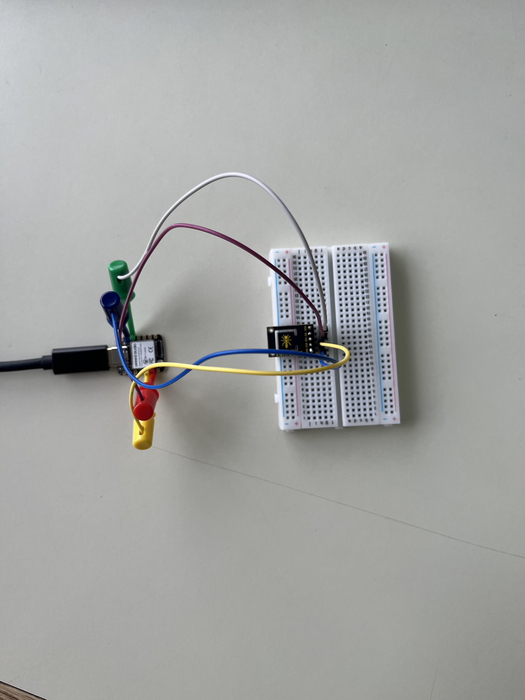
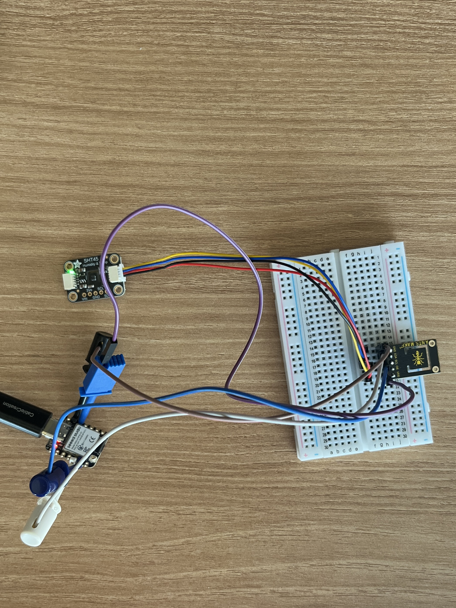
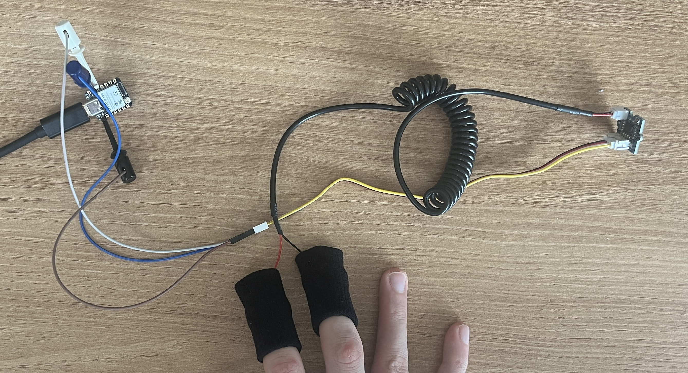
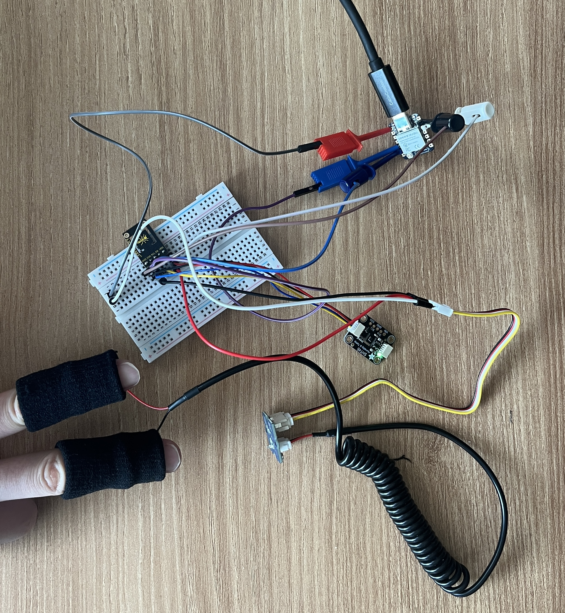

  # Smart Sweat-Band (SSB)
  **A High-Fidelity Wearable for Post-Exercise Recovery & Hydration Analytics**

  **Status:** Phase 1 - Sensor Fusion & Calibration (Initial Hardware Validated)

  ## Overview
  The Smart Sweat-Band (SSB) is a wearable diagnostic tool engineered to optimize the 20–30 minute post-exercise "recovery window" for athletes. Moving beyond generic activity tracking, the SSB establishes a personalized baseline using a custom-engineered Vapor Chamber and a multi-sensor array to provide individualized recommendations for hydration and thermal regulation post-workout.

  ## Acknowledgements 
  This project is funded by the **Dick and St. Jane Reeve Endowed Fund** at RIT.

  ## Technical Approach & Innovations
  Powered by an **ESP32-S3** microcontroller, the SSB processes three critical physiological data streams:

  1. **Vapor Chamber Hygrometry (Primary Innovation):** Solves the liquid sweat saturation problem that causes sensors to fail due to flooding because of a large amount of sweat. An SHT45 humidity sensor is housed in a micro-climate chamber separated from the skin by an ePTFE membrane, allowing water vapor to pass while blocking liquid droplets, which prevents flooding.
  2. **Clinical-Grade Thermometry:** Utilizes a MAX30205 sensor to track thermal recovery (heat dissipation efficiency) with ±0.1°C accuracy.
  3. **Dynamic Galvanic Skin Response (GSR):** Gold-plated electrodes measure skin conductivity trends to identify changes in electrolyte concentration during the period when sweat starts to dry.

  ## App Integration & Scientific Logic
  The hardware data streams to a custom mobile dashboard that generates a dynamic **Recovery Readiness Score** and personalized instructions:

  * **Rehydration Prescription:** Provides exact volume and electrolyte ratios. Utilizing the ACSM's 150% fluid replacement rule and calculating the sodium mass balance via $m_{Na} = \int (C_{sweat} \cdot V_{rate}) dt$, the app prevents dilutional hyponatremia.
  * **Gastric Emptying Rate (GER) Optimization:** The prescription is paced into 15-minute "intake windows" (e.g., 250ml every 15 mins) to prevent GI distress and ensure the body's maximum absorption capacity (~1.2L/hr) is not exceeded.
  * **Thermal Regulation Alerts:** Analyzes evaporative cooling and the Second Law of Thermodynamics to suggest immediate interventions (e.g., ice-vest application) if the athlete is in a heat-trapped state.

  ## Phase 1 Hardware: Bill of Materials (BOM)
  The current bare-metal prototype utilizes the following components:

  | Component | Description |
  | :--- | :--- |
  | **Brain** | Seeed Studio XIAO ESP32S3 |
  | **Thermometry** | MAX30205 Clinical Temperature Breakout Board (I2C) |
  | **Hygrometry** | SHT45 Humidity Sensor (I2C) |
  | **Galvanic Skin Response** | Grove GSR Sensor (Analog) |
  | **Diagnostic Tool** | Test Hook Clips & Qwiic Connectors |
  | **Tether** | 30 AWG Flexible Silicone Stranded Wire |
  | **Power/Data** | Standard USB-C Sync/Data Cable |

  ## Wiring Schematic (Phase 1: Sensor Array)

  | Component | Sensor Pin | XIAO ESP32S3 Pin | Function |
  | :--- | :--- | :--- | :--- |
  | **MAX30205 & SHT45** | `VCC` | `3V3` | Power (3.3V) |
  | *(I2C Bus)* | `GND` | `GND` | Ground |
  | | `SDA` | `D4` | I2C Data |
  | | `SCL` | `D5` | I2C Clock |
  | **Grove GSR** | `VCC` | `3V3` | Power (3.3V) |
  | *(Analog)* | `GND` | `GND` | Ground |
  | | `SIG` | `D0` (`A0`) | Analog Signal |

  ---

  ## 🚀 Project Progress & Phases

  ### Phase 1: Hardware Validation & Baseline Readings
  The first major milestone of this project was isolating and successfully communicating with each sensor individually before combining them into a master array.

  * **`phase1.0_baseline_thermometry`**
    Initial environment setup and basic I2C communication verification.
    

  * **`phase1.1_temp_read`**
    Successfully isolated and read human body temperature data from the MAX30205 sensor.

  * **`phase1.2_humidity_read`**
    Successfully isolated and read environmental data from the SHT45 sensor.

  * **`phase1.3_temp_humidity_read`**
    Merged the I2C sensors into a single script, verifying both the MAX30205 and SHT45 can share the I2C bus and output synchronous data without address conflicts.
    
    *(Place an image of your Serial Monitor or I2C wiring here named `i2c_test.png`)*
    

  * **`phase1.4_gsr_read`**
    Reverse-engineered the Grove GSR analog output logic using test hooks. Established an inverted scale map for sweat detection:
    * **> 2300:** Empty / Band Removed
    * **> 1000:** Dry Skin Contact
    * **< 1000:** Active Sweating (Electrolyte moisture detected)

    

  * **`phase1.5_sensor_fusion`**
    Successfully merged all three sensors (I2C + Analog) onto a single breadboard layout running concurrently on the ESP32S3.
    Replaced hardcoded GSR values with a dynamic software calibration sequence. Solves the issue of biological skin variance between athletes.

    