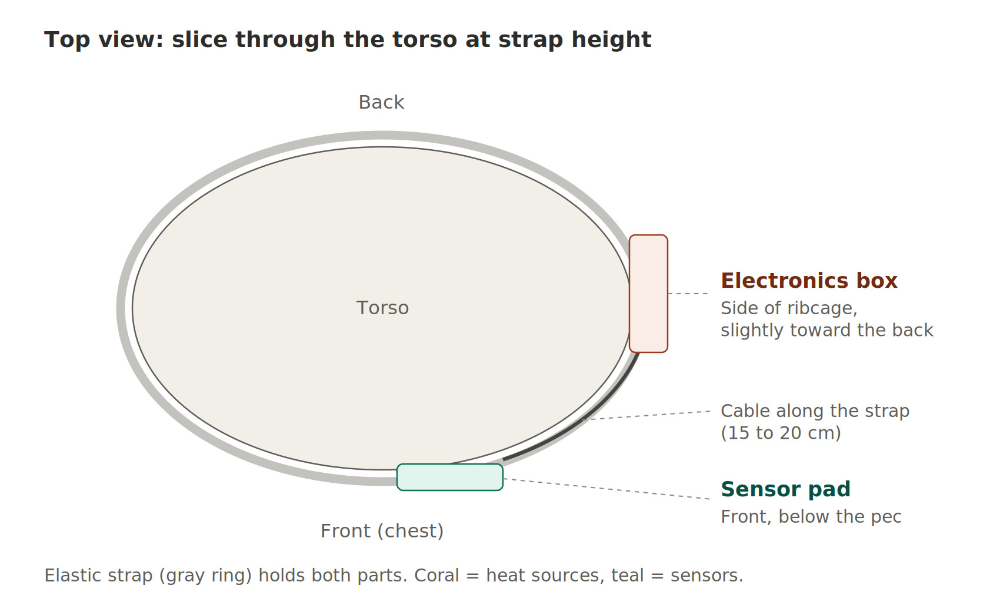
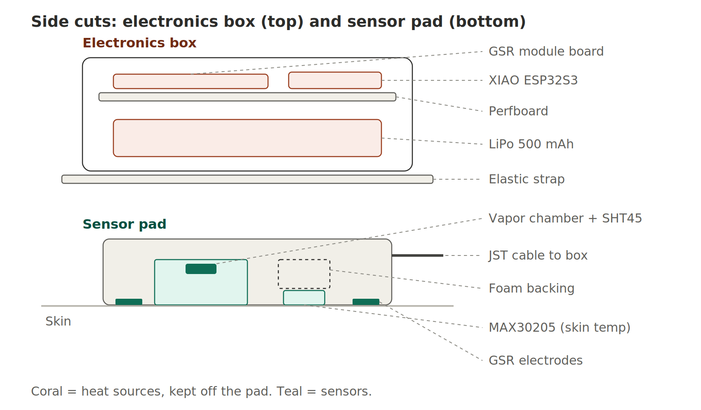
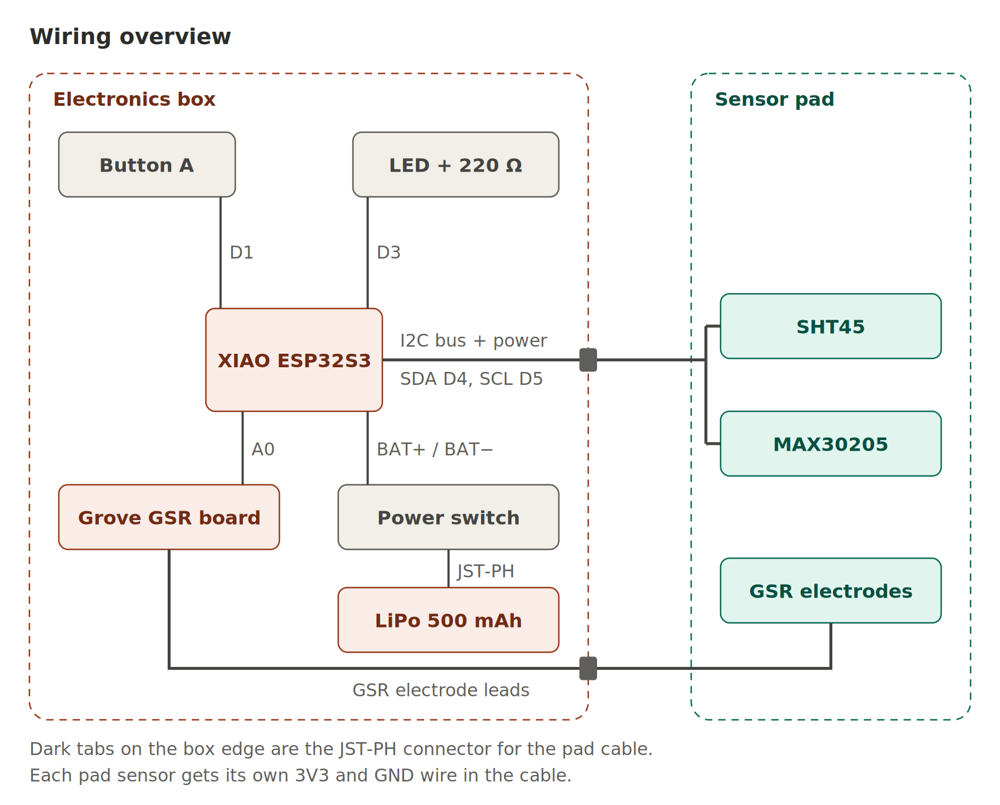

# SSB Dev Log — October 6, 2026

## Summary

Today was a planning day for the Stage 2 wearable. No code and no commits.

Now that the end-to-end test works on the breadboard, I worked out how to turn
it into something I can actually wear during a workout. I settled on where it
goes on the body (lower chest strap), how it's powered, what goes in the box
and the pad, and the build order. I made three diagrams and added a new tab to
the project Google Doc with the whole plan.

Also confirmed the GSR is fine. The low reading from Oct 2 isn't an issue
anymore.

---

## Placement: lower chest strap

I compared the inner forearm, wrist, upper arm, forehead, belly, and lower
chest. Picked the lower chest, at the height where heart-rate monitor straps
sit.

Why:
- Skin temp on the chest is steadier and closer to core temp than on the arm
  -> better thermal recovery slope.
- The ribs give the strap something firm to press against -> steady sensor
  contact, less GSR noise.
- It's under my shirt, so it won't get knocked around.

Why not the belly: breathing, bending, and running all move the skin there,
and my waistband would push the strap around.

Tradeoffs I'm accepting:
- The chest sweats a lot, so the vapor chamber fills up faster and sweat can
  run into it. The pad needs a drip edge, and the chamber design has to handle
  a higher sweat rate.
- The button and LED are under my shirt, and the strap has to come off to plug
  it in.
- I have to wear it in the exact same spot every session, since the thermal
  baseline and GSR modifier compare against my own past sessions.

---

## Layout

Four parts:
- **Sensor pad**: front of the lower chest, just under the pec, a little off
  center so it sits on ribs instead of the breastbone.
- **Electronics box**: side of the ribcage, a bit toward the back, so my arm
  doesn't hit it.
- **Cable**: about 15–20 cm, tucked along the strap.
- **Strap**: buying a replacement heart-rate monitor chest strap instead of
  making one.

The box and pad are kept apart on purpose. The XIAO and battery get warm, and
next to the sensors they'd push the skin temp and humidity readings up.

---

## Power

Read through the XIAO ESP32S3 datasheet. It already has a LiPo charger and
BAT+/BAT− pads on the bottom, so **the TP4056 isn't needed anymore**.

Battery (already bought): 3.7 V 500 mAh 503035 LiPo, 5 × 30 × 37 mm, 13 g,
JST-PH 2.0 plug, max charge 250 mA.

- The XIAO charges at only 50 mA -> about 10–12 hours from empty. But one
  90-minute session only uses about 60–75 mAh, so topping up during the
  transfer takes about 1.5 hours.
- Estimated runtime is about 10–12 hours of recording (35–50 mA). Still needs
  to be measured.
- Plan: solder a JST-PH socket to the BAT pads (instead of cutting the plug
  off), with a slide switch on the positive wire. When the switch is off, the
  battery doesn't charge.
- JST-PH cables come wired both ways -> check polarity with a multimeter before
  connecting anything.

---

## Box and pad

**Box** (PETG): XIAO, Grove GSR board, perfboard with button + LED, switch,
LiPo. Battery flat on the bottom, perfboard on top. About 45 × 38 × 18–22 mm.
The Grove GSR board is the longest part, not the battery.

**Pad** (TPU if my printer can do it): vapor chamber following the design in
the Vapor Chamber tab, MAX30205 in a foam-backed window touching skin, two GSR
electrodes at the ends, and a drip edge on top.

**Cable**: SDA, SCL, separate 3V3 + GND for each sensor (the shared loose
ground caused dropouts before), and the two GSR leads. JST-PH connector at the
box end so the pad can come off.

---

## Google Doc

- Added a new "Wearable Build (Stage 2)" tab to the project doc.
- Rewrote it in my own words, organized around the three diagrams, with an
  empty line and caption for each figure.
- The images still need to be inserted by hand. The Docs connector can only add
  images from a public link, so I'll upload them myself.
- The older parts list sections in the doc still mention the TP4056 and
  cutting the JST plug off. Left them alone for now.

---

## Lessons

- Read the board's datasheet before adding extra power parts. The XIAO already
  had the charger built in.
- Check where the device sits on the body before designing the box. Placement
  changes the pad shape, the cable length, and the strap.
- Don't trust JST-PH wire colors. Check polarity with a meter.

---

## Git

Nothing committed today (planning only).

---

## Next steps

- Insert the three diagrams into the Google Doc tab
- Clear the test sessions from history
- Body test: tape the GSR electrodes and MAX30205 to my lower chest, record at
  rest and after a workout, check GSR goes below 2300 and skin temp reads
  ~33–35 °C
- Talk to my partner about vapor chamber size and venting for chest sweat rates
- Buy the chest strap, slide switch, JST-PH sockets, and silicone wire
- Battery test: solder the socket + switch, run a full session on battery
- Still pending: GSR sweat stress test, vapor chamber calibration, backend fix
  for the stale `'R'` issue, cut-off chart labels

---

## Diagrams

